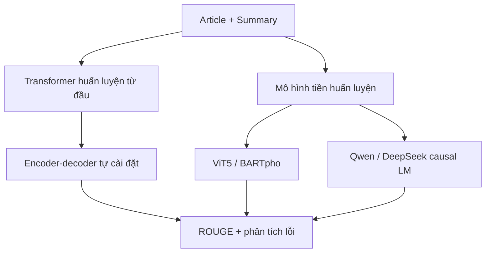

# 05. Bản đồ toàn bộ dự án

## 1. Mục tiêu hệ thống

Hệ thống nhận một bài viết tiếng Việt và sinh một đoạn tóm tắt ngắn hơn:

```text
article tiếng Việt
→ tiền xử lý/tokenizer
→ mô hình sinh có điều kiện
→ decoding
→ prediction
→ ROUGE + phân tích lỗi
```

Hai hướng bắt buộc:



## 2. Cấu trúc workspace

```text
BTL/
├── dataset/
│   ├── train-00000-of-00001.parquet
│   ├── valid-00000-of-00001.parquet
│   └── test-00000-of-00001.parquet
├── pretrained-summarization/
│   ├── configs/
│   ├── src/vn_summarization/
│   ├── scripts/
│   ├── reports/
│   └── *.ipynb
├── result_notebook_kaggle/
├── run_kaggle/
├── analyze_train_valid_dataset.py
├── train_valid_dataset_analysis.json
├── ieee_abstractive_summarization_report.tex
└── ieee_abstractive_summarization_report_vi.tex
```

## 3. Hướng Transformer scratch

Thông tin kiến trúc đã báo cáo:

| Thành phần | Giá trị |
|---|---:|
| Vocabulary | 16.000 |
| Encoder layer | 4 |
| Decoder layer | 4 |
| `d_model` | 256 |
| `d_ff` | 1.024 |
| Attention head | 8 |
| Dropout | 0.1 |
| Source max length | 512 |
| Target max length | 128 |
| Tham số | 11.469.824 |

Luồng:

```text
raw parquet
→ làm sạch và lọc
→ train SentencePiece BPE
→ token ID + cache
→ encoder-decoder Transformer
→ teacher-forced cross-entropy
→ beam search
→ prediction JSONL
→ ROUGE
```

Mã scratch chưa hiện diện dưới dạng repo Python riêng trong workspace. Các chương scratch giải thích kiến trúc và cách cài đặt chuẩn tương ứng với cấu hình đã báo cáo.

## 4. Hướng pretrained sequence-to-sequence

Luồng code chính:

```text
YAML config
→ load_splits()
→ preprocess_dataset()
→ load_tokenizer_and_model()
→ apply_lora_if_enabled()
→ Seq2SeqTrainer.train()
→ generate()
→ compute_metrics()
→ save best checkpoint + predictions
```

Các file:

| File | Trách nhiệm |
|---|---|
| [`data.py`](../src/vn_summarization/data.py) | Load parquet, làm sạch, token hóa source/target |
| [`modeling.py`](../src/vn_summarization/modeling.py) | Load tokenizer/model, dropout, checkpointing, LoRA |
| [`train.py`](../src/vn_summarization/train.py) | Tạo Trainer, train, evaluate, lưu checkpoint |
| [`metrics.py`](../src/vn_summarization/metrics.py) | Decode token và tính ROUGE |
| [`evaluate.py`](../src/vn_summarization/evaluate.py) | Đánh giá checkpoint và xuất prediction JSONL |
| [`predict.py`](../src/vn_summarization/predict.py) | Tóm tắt một văn bản mới |

## 5. Hướng causal language model

Luồng:

```text
article
→ prompt tiếng Việt
→ nối prompt + reference summary
→ mask label prompt bằng -100
→ Qwen/DeepSeek + LoRA
→ chỉ học dự đoán token summary
→ generate continuation
→ cắt prompt/phần thừa
→ ROUGE
```

Các file:

| File | Trách nhiệm |
|---|---|
| [`causal_data.py`](../src/vn_summarization/causal_data.py) | Tạo prompt, nối target, mask label |
| [`train_causal_lm.py`](../src/vn_summarization/train_causal_lm.py) | Load causal LM, LoRA, collator và train |
| [`evaluate_causal_lm.py`](../src/vn_summarization/evaluate_causal_lm.py) | Sinh continuation, làm sạch và tính ROUGE |

## 6. Config điều khiển thí nghiệm

Mỗi YAML gồm bốn phần chính:

```yaml
model:       # checkpoint, tokenizer, dtype, giới hạn tham số
data:        # file, prefix/prompt, độ dài, số mẫu
training:    # batch, LR, epoch, scheduler, checkpoint
generation:  # beams, độ dài, chống lặp
lora:        # bật/tắt, rank, alpha, dropout, target modules
```

Điểm mạnh của cấu trúc config:

- Code train không phải sửa cho mỗi thí nghiệm.
- Dễ so sánh một thay đổi tại một thời điểm.
- `resolved_config.json` ghi lại cấu hình thực tế để tái lập.

## 7. Từ input đến output: một mẫu đi qua hệ thống

### Seq2seq

```text
article
→ "summarize: " + article
→ source token IDs
→ encoder
→ encoder memory
→ decoder input: BOS + reference[:-1]
→ logits
→ loss với reference
```

Khi inference:

```text
article
→ encoder
→ decoder bắt đầu bằng BOS
→ sinh từng token
→ EOS hoặc max length
```

### Causal LM

Khi train:

```text
[prompt + article] + [summary + EOS]
labels = [-100 ... -100] + [summary token IDs]
```

Khi inference:

```text
[prompt + article]
→ model.generate()
→ chỉ lấy token sinh sau prompt
```

## 8. Output của một run

Một run tốt nên lưu:

```text
outputs/<run_name>/
├── resolved_config.json
├── train_results.json
├── eval_results.json
├── trainer_state.json
├── checkpoint-*/
├── best/
└── predictions_valid.jsonl
```

`predictions_valid.jsonl` có:

```json
{
  "article": "...",
  "summary": "...",
  "prediction": "..."
}
```

Đây là file quan trọng nhất để phân tích lỗi định tính.
