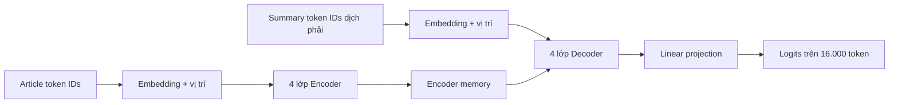
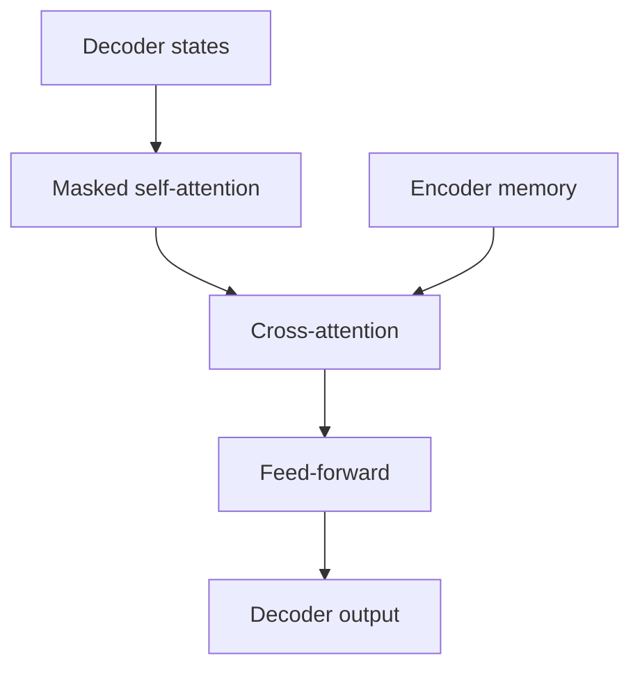

# 06. Transformer huấn luyện từ đầu: kiến trúc

## 1. “Huấn luyện từ đầu” nghĩa là gì?

Transformer scratch không bắt đầu từ checkpoint đã biết tiếng Việt. Các ma trận attention, feed-forward, embedding và output projection được khởi tạo mới rồi học từ 10.775 cặp article-summary.

Mô hình phải học đồng thời:

- Biểu diễn token tiếng Việt.
- Quan hệ ngữ pháp và ngữ nghĩa.
- Cách chọn thông tin quan trọng.
- Cách viết một bản tóm tắt.
- Cách kết thúc chuỗi và tránh lặp.

Đây là lý do scratch có giá trị học thuật cao nhưng thường thua mô hình tiền huấn luyện.

## 2. Cấu hình của dự án

| Thành phần | Giá trị | Ý nghĩa |
|---|---:|---|
| Vocabulary | 16.000 | Số subword token |
| Encoder layer | 4 | Số lớp đọc nguồn |
| Decoder layer | 4 | Số lớp sinh đích |
| `d_model` | 256 | Chiều biểu diễn mỗi token |
| `d_ff` | 1.024 | Chiều ẩn của feed-forward |
| Attention head | 8 | Số không gian attention song song |
| Head dimension | 32 | `256 / 8` |
| Dropout | 0.1 | Regularization |
| Max source | 512 token | Giới hạn article |
| Max target | 128 token | Giới hạn summary |
| Tham số | 11.469.824 | Quy mô mô hình |

## 3. Bức tranh tổng thể



Encoder đọc toàn bộ article và tạo `memory`. Decoder vừa nhìn các token summary trước đó, vừa dùng cross-attention để lấy thông tin từ memory.

## 4. Tokenization và special token

Tokenizer SentencePiece BPE biến văn bản thành subword ID.

Các special token:

| Token | Vai trò |
|---|---|
| `<PAD>` | Đệm các chuỗi trong batch |
| `<UNK>` | Đại diện phần không biểu diễn được |
| `<BOS>` | Bắt đầu chuỗi decoder |
| `<EOS>` | Kết thúc chuỗi |

Ví dụ:

```text
summary token: [y1, y2, y3]
decoder input: [BOS, y1, y2, y3]
labels:        [y1,  y2, y3, EOS]
```

## 5. Embedding và weight tying

### Token embedding

Với vocabulary `V=16000` và `d_model=256`:

```math
E \in \mathbb{R}^{16000 \times 256}
```

Một batch source token ID shape `[B, S]` được biến thành:

```text
[B, S, 256]
```

### Shared source-target embedding

Nguồn và đích đều là tiếng Việt, nên dự án dùng chung embedding. Điều này:

- Giảm số tham số.
- Cho phép source và target dùng cùng không gian token.
- Hợp lý vì cùng tokenizer.

### Output weight tying

Decoder cuối cùng cần chiếu vector 256 chiều thành logits 16.000 chiều. Weight tying dùng lại ma trận embedding cho phép chiếu này.

Lợi ích:

- Giảm tham số.
- Thường cải thiện generalization.
- Liên hệ trực tiếp biểu diễn token đầu vào với xác suất token đầu ra.

## 6. Positional encoding

Self-attention tự nó không biết token đứng trước hay sau. Positional encoding hình sin được cộng vào embedding:

```math
PE_{(pos,2i)} = \sin\left(\frac{pos}{10000^{2i/d_{model}}}\right)
```

```math
PE_{(pos,2i+1)} = \cos\left(\frac{pos}{10000^{2i/d_{model}}}\right)
```

Sau phép cộng:

```text
token representation = token embedding + positional encoding
```

Embedding trả lời “token này là gì”; positional encoding trả lời “token này ở vị trí nào”.

## 7. Scaled dot-product attention

Attention nhận ba tensor:

- `Q` - Query: vị trí hiện tại đang tìm thông tin gì?
- `K` - Key: mỗi vị trí có loại thông tin gì?
- `V` - Value: nội dung thực tế lấy về là gì?

Công thức:

```math
\mathrm{Attention}(Q,K,V)
=
\mathrm{softmax}\left(\frac{QK^T}{\sqrt{d_k}} + M\right)V
```

`M` là mask. Giá trị tại vị trí bị cấm được đặt thành số âm rất lớn trước softmax, khiến xác suất gần 0.

### Vì sao chia cho căn `d_k`?

Khi số chiều lớn, tích vô hướng `QK^T` có thể lớn, làm softmax quá sắc và gradient nhỏ. Chia cho `sqrt(d_k)` giữ giá trị ổn định hơn.

## 8. Ví dụ shape của attention

Giả sử:

```text
B = 4
S = 512
d_model = 256
heads = 8
head_dim = 32
```

Trước chia head:

```text
Q, K, V: [4, 512, 256]
```

Sau chia head:

```text
Q, K, V: [4, 8, 512, 32]
```

Attention score:

```text
Q @ K^T: [4, 8, 512, 512]
```

Mỗi head của mỗi sample có một ma trận thể hiện mức chú ý từ từng vị trí đến từng vị trí.

Sau khi nhân với `V`:

```text
context: [4, 8, 512, 32]
```

Ghép tám head:

```text
[4, 512, 256]
```

## 9. Multi-head attention

Thay vì một attention duy nhất, mô hình học tám head:

```math
\mathrm{head}_i =
\mathrm{Attention}(QW_i^Q,KW_i^K,VW_i^V)
```

```math
\mathrm{MultiHead}(Q,K,V)
=
\mathrm{Concat}(\mathrm{head}_1,\ldots,\mathrm{head}_h)W^O
```

Các head không được gán vai trò thủ công, nhưng có thể học chú ý đến:

- Tên thực thể.
- Quan hệ chủ thể-hành động.
- Số liệu.
- Cụm từ đồng nghĩa.
- Quan hệ xa trong bài viết.

## 10. Feed-forward network

Sau attention, mỗi vị trí đi qua cùng một mạng truyền thẳng:

```math
\mathrm{FFN}(x)=\mathrm{GELU}(xW_1+b_1)W_2+b_2
```

Shape:

```text
[B, T, 256]
→ [B, T, 1024]
→ GELU
→ [B, T, 256]
```

Attention trao đổi thông tin giữa các vị trí. FFN xử lý và biến đổi biểu diễn tại từng vị trí.

## 11. Encoder layer

Một encoder layer gồm:

```text
x
→ LayerNorm
→ multi-head self-attention
→ dropout
→ residual add
→ LayerNorm
→ FFN
→ dropout
→ residual add
```

Với Pre-LN:

```math
\tilde{x}=x+\mathrm{SelfAttention}(\mathrm{LayerNorm}(x))
```

```math
z=\tilde{x}+\mathrm{FFN}(\mathrm{LayerNorm}(\tilde{x}))
```

Self-attention encoder cho phép mọi token nguồn nhìn mọi token nguồn không bị padding.

## 12. Encoder memory là gì?

Sau bốn encoder layer, ta có:

```text
memory shape = [B, S, d_model]
```

Memory không phải một vector nén duy nhất. Nó giữ một vector ngữ cảnh cho từng vị trí nguồn. Decoder dùng cross-attention để truy vấn các vị trí liên quan khi sinh từng token summary.

## 13. Decoder layer

Mỗi decoder layer gồm ba khối:

1. Masked self-attention trên summary đã có.
2. Cross-attention với encoder memory.
3. Feed-forward network.



### Masked self-attention

Vị trí `t` chỉ được nhìn các vị trí `≤t`. Nếu decoder nhìn tương lai trong train, nó sẽ thấy đáp án cần dự đoán.

### Cross-attention

Trong cross-attention:

- Query đến từ decoder.
- Key và Value đến từ encoder memory.

Nghĩa là decoder hỏi: “để sinh token summary tiếp theo, tôi cần nhìn phần nào của article?”

## 14. Mask chi tiết

### Source padding mask

Ngăn encoder chú ý đến `<PAD>` trong article.

### Target padding mask

Ngăn decoder xử lý `<PAD>` trong summary.

### Causal mask

Ma trận tam giác:

```text
vị trí 1 nhìn: 1
vị trí 2 nhìn: 1, 2
vị trí 3 nhìn: 1, 2, 3
...
```

### Cross-attention mask

Ngăn decoder chú ý tới phần padding trong encoder memory.

## 15. Output projection và logits

Decoder output có shape:

```text
[B, T, 256]
```

Output projection biến thành:

```text
[B, T, 16000]
```

Mỗi vị trí có 16.000 logits. Softmax biến logits thành phân phối xác suất. Trong train, cross-entropy thường nhận logits trực tiếp để tính ổn định số học.

## 16. Tại sao chọn mô hình nhỏ?

Scratch dùng 11,47 triệu tham số vì:

- Dữ liệu chỉ 10.775 mẫu.
- GPU và thời gian có hạn.
- Mục tiêu là tự cài đặt và chứng minh mô hình học được.
- Mô hình quá lớn từ khởi tạo ngẫu nhiên dễ overfit hoặc chưa hội tụ.

Đổi lại, năng lực ngôn ngữ và khả năng giữ chi tiết thấp hơn ViT5 227,72 triệu tham số đã tiền huấn luyện.

## 17. Một forward pass hoàn chỉnh

```text
src_ids [B,S]
→ shared embedding + positional encoding
→ source states [B,S,256]
→ 4 encoder layers
→ memory [B,S,256]

tgt_input_ids [B,T]
→ shared embedding + positional encoding
→ target states [B,T,256]
→ 4 decoder layers, mỗi lớp dùng memory
→ decoder states [B,T,256]
→ tied output projection
→ logits [B,T,16000]
```

## 18. Cách tự kiểm tra cài đặt scratch

Một cài đặt đúng nên vượt qua các kiểm tra:

1. Shape không đổi sau mỗi residual block.
2. `d_model % num_heads == 0`.
3. Attention tới padding gần bằng 0.
4. Decoder không thể nhìn token tương lai.
5. Labels padding bị bỏ qua trong loss.
6. Với batch rất nhỏ, mô hình có thể overfit gần hoàn toàn.
7. Train loss giảm sau vài trăm step.
8. `model.eval()` làm prediction ổn định.

