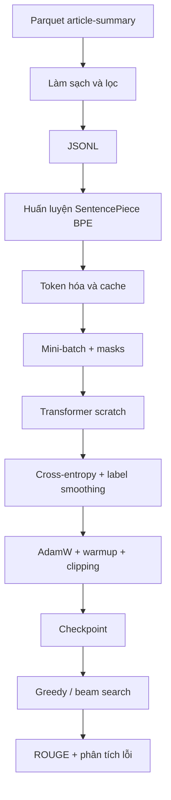

# 07. Transformer huấn luyện từ đầu: dữ liệu, train và giải mã

## 1. Toàn bộ pipeline scratch



## 2. Làm sạch và lọc dữ liệu

Theo báo cáo, scratch pipeline lọc:

- Source từ 30 đến 900 từ.
- Target từ 3 đến 180 từ.
- Tỷ lệ `target/source ≤ 0.9`.

Mục đích:

- Loại mẫu rỗng hoặc quá ngắn.
- Loại trường hợp “summary” gần dài bằng article.
- Giảm nhiễu trước khi train tokenizer và mô hình.

Cần cẩn thận: lọc quá mạnh có thể làm phân phối train khác validation/test.

## 3. Huấn luyện tokenizer

Tokenizer SentencePiece BPE được học **chỉ trên corpus train**.

Vì sao không dùng validation/test?

- Tokenizer cũng là một thành phần học từ dữ liệu.
- Dùng validation/test để học vocabulary tạo ra một dạng leakage nhẹ.

Sau khi train, cần lưu:

```text
tokenizer.model
tokenizer.vocab
special token IDs
vocab size
```

Mọi lần train/evaluate/predict phải dùng đúng cùng tokenizer.

## 4. Token hóa và cache

Token hóa có thể tốn thời gian. Scratch pipeline cache kết quả:

```text
article text → source IDs
summary text → target IDs
```

Lợi ích:

- Không token hóa lại mỗi epoch.
- Train nhanh và tái lập hơn.

Rủi ro:

- Nếu đổi tokenizer hoặc `max_length`, cache cũ không còn hợp lệ.
- Nên ghi phiên bản hoặc hash cấu hình cùng cache.

## 5. Tạo một batch

Giả sử batch gồm bốn mẫu. Mỗi mẫu có độ dài khác nhau nên cần padding.

Batch thường gồm:

```text
src_ids:          [B, S]
tgt_input_ids:    [B, T]
labels:           [B, T]
src_padding_mask: [B, S]
tgt_padding_mask: [B, T]
causal_mask:      [T, T]
```

Ví dụ dịch phải target:

```text
target gốc:       [y1, y2, y3, EOS]
decoder input:    [BOS, y1, y2, y3]
label cần đoán:   [y1, y2, y3, EOS]
```

## 6. Teacher forcing và loss

Trong train, mô hình không phải chờ sinh từng token. Toàn bộ decoder input đúng được đưa vào cùng lúc, nhưng causal mask ngăn nhìn tương lai.

Loss:

```math
\mathcal{L}=-\sum_t \log P(y_t|y_{<t},X)
```

Padding label phải bị bỏ qua. Trong PyTorch thường dùng `ignore_index=pad_id` hoặc chuyển padding label thành `-100`.

## 7. Label smoothing

Với nhãn one-hot thông thường:

```text
token đúng: xác suất mục tiêu 1.0
mọi token khác: 0.0
```

Label smoothing phân phối một phần nhỏ xác suất sang token khác. Mục đích:

- Giảm quá tự tin.
- Cải thiện generalization.
- Hạn chế mô hình gán xác suất gần tuyệt đối cho token train.

Không nên đặt quá cao vì sẽ làm tín hiệu nhãn yếu.

## 8. Một training step chi tiết

Pseudo-code:

```python
model.train()
optimizer.zero_grad()

logits = model(
    src_ids,
    tgt_input_ids,
    src_padding_mask,
    tgt_padding_mask,
    causal_mask,
)

loss = criterion(
    logits.reshape(-1, vocab_size),
    labels.reshape(-1),
)

loss.backward()
clip_grad_norm_(model.parameters(), max_norm)
optimizer.step()
scheduler.step()
```

Ý nghĩa từng bước:

1. `model.train()` bật dropout.
2. Forward tạo logits.
3. Criterion so logits với labels.
4. `backward()` tính gradient.
5. Gradient clipping hạn chế gradient spike.
6. AdamW cập nhật tham số.
7. Scheduler thay đổi learning rate.

## 9. Warmup và inverse-square-root decay

Transformer scratch dùng lịch learning rate kiểu Transformer:

```text
giai đoạn đầu: learning rate tăng dần
sau warmup: learning rate giảm theo nghịch đảo căn bậc hai của step
```

Lý do:

- Đầu train, biểu diễn ngẫu nhiên và gradient chưa ổn định.
- Sau khi mô hình bắt đầu học, learning rate giảm dần để tinh chỉnh.

## 10. Epoch và checkpoint

Scratch train 10 epoch. Sau mỗi giai đoạn cần ghi:

- Train loss.
- Validation loss.
- Validation ROUGE.
- Learning rate.
- Checkpoint.

Kết quả loss:

| Epoch | Train loss | Validation loss |
|---:|---:|---:|
| 1 | 7.2442 | 6.4236 |
| 5 | 5.4425 | 5.3829 |
| 10 | 5.0707 | 5.1026 |

Train và validation loss cùng giảm, cho thấy tối ưu ổn định. Tuy nhiên loss vẫn cao hơn pretrained vì scratch phải học ngôn ngữ từ dữ liệu nhỏ.

## 11. Validation đúng cách

Khi validation:

```python
model.eval()
with torch.no_grad():
    ...
```

- `model.eval()` tắt dropout.
- `torch.no_grad()` không lưu graph gradient, giảm bộ nhớ.

Có hai kiểu validation:

1. **Teacher-forced validation loss**: nhanh, nhưng decoder được nhận token đúng trước.
2. **Generated validation ROUGE**: chậm hơn, phản ánh inference thực tế.

Cần cả hai. Loss cho biết khả năng dự đoán token; ROUGE cho biết chất lượng chuỗi sinh.

## 12. Greedy decoding

Thuật toán:

```text
sequence = [BOS]
lặp:
    tính xác suất token tiếp theo
    chọn token xác suất cao nhất
    nối token vào sequence
    dừng nếu EOS hoặc đạt max length
```

Ưu:

- Nhanh.
- Dễ cài đặt và debug.

Nhược:

- Quyết định sai sớm không thể sửa.
- Không tìm kiếm chuỗi có điểm tổng thể tốt hơn.

## 13. Beam search

Beam search giữ `k` ứng viên.

Ví dụ beam size 2:

```text
BOS
→ giữ hai token đầu tốt nhất
→ mở rộng mỗi chuỗi
→ chấm điểm tất cả chuỗi mới
→ tiếp tục giữ hai chuỗi tốt nhất
```

Điểm chuỗi thường là tổng log-probability, có điều chỉnh length penalty:

```math
\mathrm{score}(Y)=
\frac{\sum_t \log P(y_t|y_{<t},X)}
{\mathrm{lengthPenalty}(|Y|)}
```

Beam search của scratch cải thiện ROUGE-1 và ROUGE-2 nhẹ so với greedy, nhưng ROUGE-L gần tương đương:

| Giải mã | R1 | R2 | RL |
|---|---:|---:|---:|
| Greedy | 0.5724 | 0.2003 | 0.3057 |
| Beam + length penalty + no-repeat 3-gram | 0.5768 | 0.2087 | 0.3053 |

## 14. Chặn n-gram lặp lại

Với `no_repeat_ngram_size=3`, mô hình không được sinh lại một cụm ba token đã có.

Lợi ích:

- Giảm lặp vòng.
- Trong kết quả scratch, tỷ lệ 3-gram lặp đạt gần 0.

Rủi ro:

- Một số cụm hợp lệ có thể cần xuất hiện lại.
- Nó che triệu chứng lặp nhưng không sửa kiến thức của mô hình.

## 15. Vì sao scratch thua ViT5?

### Không có tiền huấn luyện

Scratch phải học tiếng Việt từ 10.775 mẫu. ViT5 đã học biểu diễn ngôn ngữ từ corpus lớn trước đó.

### Quy mô nhỏ hơn

Scratch 11,47 triệu tham số; ViT5 227,72 triệu tham số.

### Source/target ngắn hơn

Scratch dùng source 512 và target 128 token. ViT5 dùng source 768 và target 160 token.

### Dataset yêu cầu bám nguồn và tổ chức lại câu

ViT5 đã có biểu diễn ngôn ngữ tốt, nên dễ chọn và diễn đạt lại cụm từ hơn.

## 16. Lỗi định tính thường gặp

- Bỏ tên riêng, địa điểm hoặc số liệu.
- Nắm chủ đề nhưng viết quá chung chung.
- Thêm chi tiết sự kiện không có trong nguồn.
- Bỏ thông tin nằm cuối article do truncation.
- Tóm tắt ngắn quá hoặc dài quá.

## 17. Cách cải thiện scratch có kiểm soát

Thử từng thay đổi riêng:

1. Tăng source length nếu GPU cho phép.
2. Tăng target length lên 160.
3. Tăng nhẹ `d_model` hoặc số layer, theo dõi overfitting.
4. Dùng tokenizer tốt hơn hoặc vocabulary khác.
5. Tăng dữ liệu hoặc tiền huấn luyện embedding.
6. Điều chỉnh label smoothing và dropout.
7. Chọn checkpoint bằng generated validation ROUGE-L.
8. Thử beam size và length penalty trên validation.

Không nên đổi nhiều yếu tố cùng lúc vì sẽ không biết yếu tố nào tạo ra cải thiện.

## 18. Bài tập tự kiểm tra

1. Viết shape của Q/K/V trong encoder self-attention với batch 4, source 512.
2. Giải thích tại sao decoder input phải dịch phải so với labels.
3. Điều gì xảy ra nếu quên causal mask?
4. Vì sao validation loss thấp chưa đảm bảo beam-search ROUGE cao?
5. Vì sao source length 512 có thể gây bất lợi trên dataset này?

